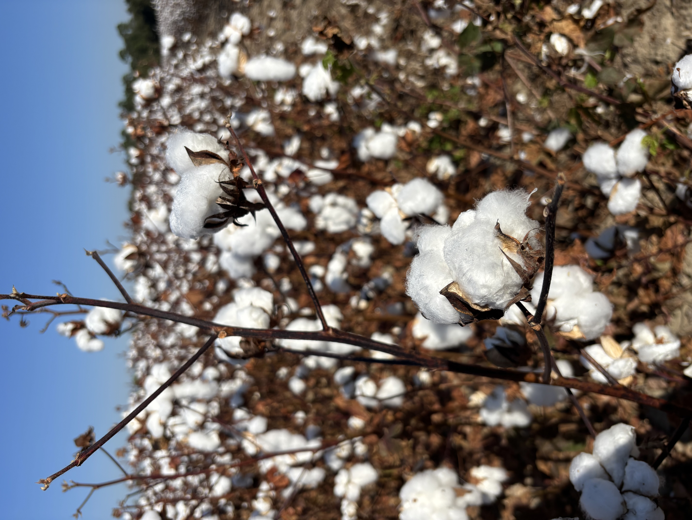

```{r Install Tinytex, eval=FALSE}
install.packages('tinytex')
tinytex::install_tinytex()
```

```{r setup, include=FALSE}
knitr::opts_chunk$set(echo = TRUE)
library(knitr)
library(ggplot2)
library(markdown)

```

```{r}
data("mtcars")
ggplot(mtcars, aes(x = wt, y = mpg)) +
  geom_smooth(method = lm, se = FALSE) +
  geom_point(aes(color = wt)) +
  xlab("Weight") + 
  ylab("Miles per gallon") +
  scale_colour_gradient(low = "yellow", high = "pink")
```

# First-level header

## Second-level header

### Third-level header
*italic*
_italic_
**bold**
__bold__
> "Once a week I would question my life choices."
>
> --- Kimmie

- one item
- one item
- one item
    - one more item
    - one more item
    - one more item
    
1. the first item
2. the second item
3. the third item
    - one unordered item
    - one unordered item


https://agriculture.auburn.edu/about/directory/faculty/zachary-noel/
<https://agriculture.auburn.edu/about/directory/faculty/zachary-noel/>
[Noel Lab](https://agriculture.auburn.edu/about/directory/faculty/zachary-noel/)



First Header  | Second Header
------------- | -------------
Content Cell  | Content Cell
Content Cell  | Content Cell

```{r}
kable(head(mtcars, n = 5), digits = 3, format = "markdown")
```


## File Tree

- [Coding Pratice 4](Coding Practice assignment 4.Rmd)
