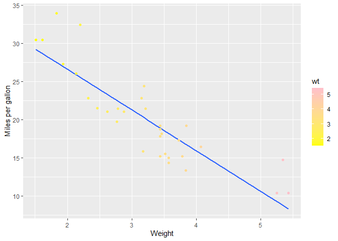

``` r
install.packages('tinytex')
tinytex::install_tinytex()
```

``` r
data("mtcars")
ggplot(mtcars, aes(x = wt, y = mpg)) +
  geom_smooth(method = lm, se = FALSE) +
  geom_point(aes(color = wt)) +
  xlab("Weight") + 
  ylab("Miles per gallon") +
  scale_colour_gradient(low = "yellow", high = "pink")
```

    ## `geom_smooth()` using formula = 'y ~ x'

<!-- -->

# First-level header

## Second-level header

### Third-level header

*italic* *italic* **bold** **bold** \> “Once a week I would question my
life choices.” \> \> — Kimmie

- one item
- one item
- one item
  - one more item
  - one more item
  - one more item

1.  the first item
2.  the second item
3.  the third item
    - one unordered item
    - one unordered item

<https://agriculture.auburn.edu/about/directory/faculty/zachary-noel/>
<https://agriculture.auburn.edu/about/directory/faculty/zachary-noel/>
[Noel
Lab](https://agriculture.auburn.edu/about/directory/faculty/zachary-noel/)

<figure>

<figcaption aria-hidden="true">Plant</figcaption>
</figure>

| First Header | Second Header |
|--------------|---------------|
| Content Cell | Content Cell  |
| Content Cell | Content Cell  |

``` r
kable(head(mtcars, n = 7), digits = 3, format = "markdown")
```

|                   |  mpg | cyl | disp |  hp | drat |    wt |  qsec |  vs |  am | gear | carb |
|:------------------|-----:|----:|-----:|----:|-----:|------:|------:|----:|----:|-----:|-----:|
| Mazda RX4         | 21.0 |   6 |  160 | 110 | 3.90 | 2.620 | 16.46 |   0 |   1 |    4 |    4 |
| Mazda RX4 Wag     | 21.0 |   6 |  160 | 110 | 3.90 | 2.875 | 17.02 |   0 |   1 |    4 |    4 |
| Datsun 710        | 22.8 |   4 |  108 |  93 | 3.85 | 2.320 | 18.61 |   1 |   1 |    4 |    1 |
| Hornet 4 Drive    | 21.4 |   6 |  258 | 110 | 3.08 | 3.215 | 19.44 |   1 |   0 |    3 |    1 |
| Hornet Sportabout | 18.7 |   8 |  360 | 175 | 3.15 | 3.440 | 17.02 |   0 |   0 |    3 |    2 |
| Valiant           | 18.1 |   6 |  225 | 105 | 2.76 | 3.460 | 20.22 |   1 |   0 |    3 |    1 |
| Duster 360        | 14.3 |   8 |  360 | 245 | 3.21 | 3.570 | 15.84 |   0 |   0 |    3 |    4 |

## File Tree

- [Coding Pratice 4](Coding%20Practice%20assignment%204.Rmd)

<!-- -->

    ├── ClassExampleKim.Rproj          #Top level directort .Rproj file=working directory
    ├── Coding Practice assignment 4.Rmd
    ├── Coding-Practice-assignment-4.html
    ├── Coding-Practice-assignment-4.md     #github formatted markdown
    ├── Coding-Practice-assignment-4_files
    │   ├── figure-gfm
    │   │   └── unnamed-chunk-1-1.png
    │   └── figure-html
    ├── CottonBoll.jpg
    ├── example html.Rmd
    ├── example-html.html
    └── README.md    # top level directory README

\#Zenodo link
[](https://doi.org/10.5281/zenodo.14938995)
